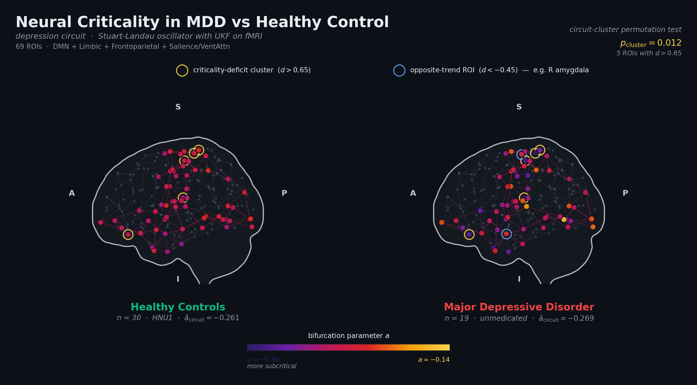

<div align="center">

<picture>
  <source media="(prefers-color-scheme: dark)" srcset="assets/hero_mdd_vs_hc_circuit.png">
  
</picture>

# Same Brain, Different Neural Criticality

### How Estimation Approach Shapes the Stuart-Landau Bifurcation Parameter in Health and Depression

[](https://www.r-project.org/)
[](https://www.python.org/)
[]()
[]()
[]()
[-orange)]()

---

*If the bifurcation parameter depends on how you estimate it,  
what is each approach actually measuring — and does depression change it?*

</div>

---

## Overview

This repository contains the analysis pipeline for a **cross-condition comparison** of whole-brain dynamics between healthy controls (HC) and unmedicated Major Depressive Disorder (MDD), using three independent estimation approaches applied to the **Stuart-Landau oscillator** — the normal form of a supercritical Hopf bifurcation.

A prior study established that MDD resting-state dynamics are deeply subcritical ($a \approx -0.29$) and that amygdala neurofeedback shifts the bifurcation parameter within-subject ($d = -0.835$). This study asks two follow-up questions: (1) do HC dynamics occupy a different regime, and (2) do different estimation approaches agree on where that regime lies?

The central findings are threefold. First, all three approaches converge on a **whole-brain null** — HC and MDD are indistinguishable at the global level. Second, the approaches place the dynamical operating point at **systematically different locations**: from deeply subcritical (UKF: $a \approx -0.26$) through moderately subcritical (spectral: $a \approx -0.16$; SC-constrained FC-matching: $a \approx -0.07$), demonstrating that the numerical value is approach-dependent even when the qualitative conclusions converge. Third, **circuit-specific analysis** reveals a significant cluster of DMN/limbic regions ($p = 0.012$) where the criticality-deficit hypothesis holds locally, with the right amygdala showing an opposite trend consistent with hyperreactivity.

---

## Study Design

<table>
<tr>
<td width="50%">

**Healthy Controls — HNU1 Dataset**
- 30 subjects, 10 sessions each (~3-day intervals)
- Consortium for Reliability and Reproducibility (CoRR)
- Hangzhou Normal University, 3T GE Discovery MR750
- Multi-session averaging for trait-level estimates

**MDD Cohort — Neurofeedback Dataset**
- 19 paired subjects (from 23 enrolled)
- Unmedicated MDD (DSM-IV-TR)
- Double-blind, sham-controlled rtfMRI-NF
- Active ($n = 11$): left amygdala upregulation
- Sham ($n = 8$): left intraparietal sulcus

</td>
<td width="50%">

**Acquisition**
- MDD: Siemens 3T, TR = 2.0 s, TE = 30 ms, $3.1 \times 3.1 \times 2.5$ mm, 260 volumes
- HC: GE 3T, TR = 2.0 s, TE = 30 ms, $3.4 \times 3.4 \times 3.4$ mm, 300 volumes
- Resting-state pre/post-NF (MDD); 10 resting-state sessions (HC)

**Parcellation**
- Primary: Schaefer-200 + Melbourne-16 subcortical (216 ROIs)
- Validation: Harvard-Oxford 110-ROI (adaptive sphere radius)

**Preprocessing**
- MDD: AFNI `afni_proc.py`, 17-regressor confound model incl. RETROICOR
- HC: LIBR-matched pipeline (fMRIPrep + confound regression, no RETROICOR)

</td>
</tr>
</table>

---

## Three Estimation Approaches

A terminological note: these are "estimation approaches" rather than "estimators." Each defines and measures a different dynamical property of the data, albeit one that maps onto the control parameter $a$ within the Stuart-Landau framework.

| Approach | Domain | What It Estimates | HC $a$ | MDD $a$ |
|----------|--------|-------------------|--------|---------|
| **UKF State-Space** | Time | Per-TR decay rate via Unscented Kalman Filter | $-0.259$ | $-0.267$ |
| **Spectral Lorentzian NLS** | Frequency | BOLD power spectrum peak width | $-0.158$ | $-0.150$ |
| **SC-FC Matching** | Spatial correlation | Coupled SL network regime maximizing FC correlation | $-0.073$ | $-0.030$ |
| *Deco et al. 2017 (DTI-SC)* | *Spatial correlation* | *Full framework with tractography + hemodynamics* | $\approx -0.02$ | — |

The Stuart-Landau equation in complex form:

$$\dot{z} = (a + i\omega)\,z \ - \ |z|^2\,z \ + \ \eta(t)$$

The SC-FC matching uses a distance-based structural connectivity approximation ($SC_{ij} = \exp(-d_{ij}/\lambda)$, $\lambda = 40$ mm) rather than subject-specific tractography, with fixed global coupling $G = 0.5$ and no hemodynamic forward model. The remaining gap between our SC-FC estimate ($a \approx -0.07$) and the Deco reference ($a \approx -0.02$) likely reflects these simplifications.

---

## Pipeline Architecture

```
┌──────────────────────────────────────────────────────────────────────────┐
│                     parcellate_hc_hnu1_v3.ipynb                          │
│  HC NIfTI  ──▸  fMRIPrep + confound regression  ──▸  Atlas ROI CSVs      │
└──────────────────────────────────┬───────────────────────────────────────┘
                                   │
                                   ▼
┌──────────────────────────────────────────────────────────────────────────┐
│                    MDD-HC_analysis_v4.ipynb  (R kernel)                  │
│                                                                          │
│  ┌──────────────────┐  ┌──────────────────┐  ┌───────────────────────┐   │
│  │  Path 1: UKF     │  │  Path 2: Spectral│  │  Path 3: SC-FC        │   │
│  │  Multi-session   │  │  Lorentzian NLS  │  │  Distance-based SC    │   │
│  │  averaging       │  │  peak-width fit  │  │  + FC correlation     │   │
│  │  (71,928 fits)   │  │                  │  │  optim (216 × 216)    │   │
│  └────────┬─────────┘  └────────┬─────────┘  └──────────┬────────────┘   │
│           │                     │                       │                │
│           ▼                     ▼                       ▼                │
│  ┌──────────────────────────────────────────────────────────────────┐    │
│  │  Cross-condition: HC vs MDD  ·  Cross-method comparison          │    │
│  │  Sensitivity power analysis  ·  R_SCALE sensitivity              │    │
│  │  Depression-circuit permutation test (69 ROIs)                   │    │
│  │  Treatment replication across all three approaches               │    │
│  │  Test-retest reliability (ICC, split-half, session curve)        │    │
│  └──────────────────────────────────────────────────────────────────┘    │
└──────────────────────────────────────────────────────────────────────────┘
                                   │
                                   ▼
┌──────────────────────────────────────────────────────────────────────────┐
│                    ch5_supplement_corrected.ipynb                        │
│  NF treatment effects  ──▸  Corrected group labels (participants.tsv)    │
│  SC-FC circuit analysis ──▸  Full 216-ROI atlas with dual FC masks       │
└──────────────────────────────────────────────────────────────────────────┘
```

---

## Key Results

<table>
<tr>
<td width="50%">

**Cross-Condition (HC vs MDD)**
- UKF: $d = 0.13$, $p = 0.68$ (null)
- Spectral: $d = -0.14$, $p = 0.64$ (null)
- SC-FC: $d = -0.33$, $p = 0.25$ (null)
- TOST at $d < 0.50$: $p = 0.13$ (not equivalent — asymmetric precision)
- All 8 network-level tests: Bonferroni $p > 1.0$
- Sensitivity: minimum detectable effect at 80% power is $d = 0.94$

**Method Gradient**
- UKF: $a \approx -0.26$ (deeply subcritical)
- Spectral: $a \approx -0.16$ (moderately subcritical)
- SC-FC: $a \approx -0.07$ (mildly subcritical)
- Cross-method $r$ = 0.37 (HC), 0.53 (MDD) — 15-25% shared variance

</td>
<td width="50%">

**Treatment Effects (Corrected Group Labels)**
- UKF whole-brain: $d = -0.835$, $p = 0.080$
- UKF depression circuit: $d = -1.094$, $p = 0.027$ ✱
- Spectral circuit: $d = -0.606$, $p = 0.220$
- SC-FC whole-brain: $d = -0.034$, $p = 0.946$
- SC-FC circuit: $d = +0.024$, $p = 0.959$

**Circuit-Specific Analysis (69 ROIs)**
- Permutation cluster test: $p = 0.012$ (5 ROIs with $d > 0.65$)
- Top ROIs: RH Default Temporal 2 ($d = +0.94$), LH Default PFC 7 ($d = +0.78$), LH Limbic TempPole 1 ($d = +0.67$)
- Right amygdala opposite trend: $d = -0.50$, $p = 0.13$
- No individual ROI survives FDR ($p_{\text{FDR}} = 0.39$)

**Reliability (HC, 10 sessions)**
- Single-session ICC: 0.06 (HC), 0.14 (MDD)
- Split-half ICC (5 vs 5 sessions): 0.25
- Session-one vs rest-average: $r = 0.45$
- $2.8\times$ variance reduction from multi-session averaging

</td>
</tr>
</table>

---

## R_SCALE Sensitivity

A single hyperparameter choice — the UKF observation noise scale — determines whether the HC-MDD comparison is null or significant:

| Calibration Strategy | $d$ | $p$ |
|---------------------|-----|-----|
| MDD group-level $R_{\text{scale}} = 0.079$ | $0.00$ | $0.999$ |
| HC group-level $R_{\text{scale}} = 0.216$ | $0.57$ | $0.04$ |
| Per-subject, single session | $-0.12$ | $0.70$ |
| Per-subject, multi-session averaged | $+0.13$ | $0.68$ |

Per-subject calibration resolves the ambiguity by matching each subject's noise model to their own data.

---

## Repository Structure

```
├── MDD-HC_analysis_v4.ipynb             # Main cross-condition analysis (R kernel)
├── R/
│   ├── sl_models.R                       # Stuart-Landau ODE definitions
│   ├── ukf_engine.R                      # Unscented Kalman Filter core
│   ├── optim.R                           # Iterative & L-BFGS-B optimization
│   ├── preprocessing.R                   # Smoothing & signal conditioning
│   └── constants.R                       # UKF tuning constants
├── data/
│   ├── source/
│   │   ├── processed rest scans/         # MDD AFNI BRIK/HEAD (rest1)
│   │   ├── processed rest2 scans/        # MDD AFNI BRIK/HEAD (rest2)
│   │   └── participants.tsv              # Authoritative group assignments (E#### keys)
│   ├── HNU1/                             # HC raw NIfTI (30 subjects × 10 sessions)
│   │   ├── 0025427/session_1..10/rest_1/
│   │   └── ...0025456/
│   └── parcellated/
│       ├── 219roi/rest1/                 # MDD parcellated time series
│       ├── 219roi/rest2/
│       └── hc_hnu1/                      # HC parcellated time series
├── atlases/
│   ├── Schaefer2018_200Parcels_*.nii.gz
│   └── Tian_Subcortex_S1_3T_2009cAsym.nii.gz
├── img/
│   ├── variance_reduction.png            # SD vs sessions curve
│   ├── h1_averaged_violin.png            # HC vs MDD violin plot
│   ├── h2_network_lollipop.png           # Network-level effect sizes
│   ├── power_analysis.png                # Sensitivity power curve
│   ├── method_gradient_bar.png           # Three-approach comparison
│   ├── nf_treatment_methods.png          # Treatment effect across approaches
│   ├── circuit_roi_effects.png           # Depression-circuit ROI lollipop
│   ├── permutation_test.png              # Cluster test null distribution
│   ├── icc_by_sessions.png               # ICC improvement curve
│   ├── cross_method_scatter.png          # UKF vs spectral correlation
│   └── rscale_sensitivity.png            # R_SCALE sensitivity analysis
```

---

## Critical Methodological Notes

**Per-Subject R_SCALE Calibration** — The UKF observation noise scale is calibrated per subject to match each individual's BOLD signal variance ($R_{\text{scale}}$: HC $= 0.217 \pm 0.030$; MDD $= 0.216 \pm 0.057$; $t = 0.04$, $p = 0.97$). Without per-subject calibration, the HC-MDD comparison swings from $d = 0.00$ to $d = 0.57$ depending on which group-level value is applied — an artifact of differential noise response, not a genuine dynamical difference.

**Atlas Affine Robustness** — NIfTI affine extraction uses a three-level fallback chain (sform → qform → manual pixdim/qoffset construction with MNI bounding-box validation) to handle inconsistent atlas headers across datasets.

**Multi-Session Averaging** — HC estimates average across a mean of 9.8 sessions ($2.8\times$ SD reduction); MDD estimates average rest1 + rest2. The resulting precision asymmetry (HC SD $= 0.025$ vs MDD SD $= 0.079$) drives the high minimum detectable effect ($d = 0.94$) and the failure of TOST equivalence testing.

**Distance-Based SC Approximation** — Subject-specific diffusion-weighted imaging is unavailable for either cohort. Structural connectivity is approximated by exponential distance decay ($\lambda = 40$ mm), validated against tractography in the literature. This differs from the canonical Deco framework in four respects: (i) distance-based rather than DTI-derived SC; (ii) no hemodynamic forward model; (iii) fixed $G$ rather than joint $G$-$a$ optimization; (iv) uniform rather than empirically derived intrinsic frequencies.

---

## Requirements

<table>
<tr>
<td>

**R packages**
```
pracma, MASS, Matrix, dplyr,
tidyr, ggplot2, scales, glmnet,
igraph, parallel, zoo, psych,
equivalence
```

</td>
<td>

**Python packages**
```
nibabel, nilearn, numpy,
pandas, scipy, tqdm,
matplotlib
```

</td>
</tr>
</table>

**System:** R ≥ 4.2 · Python ≥ 3.9 · AFNI (MDD preprocessing only) · fMRIPrep (HC preprocessing)

---

## Quick Start

```bash
# 1. Clone and set up
git clone ...
cd ...

# 2. Place source data
#    data/source/processed rest scans/      (MDD rest1 BRIK/HEAD)
#    data/source/processed rest2 scans/     (MDD rest2 BRIK/HEAD)
#    data/source/participants.tsv            (group assignments — CRITICAL)
#    data/HNU1/0025427..0025456/             (HC NIfTI, 10 sessions each)
#    atlases/Tian_Subcortex_S1_3T_2009cAsym.nii.gz

# 3. Parcellate HC data (~5 hours)
jupyter execute parcellate_hc_hnu1_v3.ipynb

# 4. Run cross-condition analysis (~18 hours, 71,928 UKF fits)
jupyter execute MDD-HC_analysis_v4.ipynb

# Results → results/ and img/
```

---

## Citation

If you use this pipeline or build on this work, please cite:

---

<div align="center">

*Built with the [Stuart-Landau](https://en.wikipedia.org/wiki/Stuart%E2%80%93Landau_equation) normal form · [Unscented Kalman Filter](https://github.com/insilico/UKF) · [SL-UKF_Neural_Criticality_MDD](https://github.com/skaraoglu/SL-UKF_Neural_Criticality_MDD) · [Schaefer 2018](https://github.com/ThomasYeoLab/CBIG/tree/master/stable_projects/brain_parcellation/Schaefer2018_LocalGlobal) + [Melbourne Subcortex](https://github.com/yetianmed/subcortex) · [HNU1/CoRR](https://fcon_1000.projects.nitrc.org/indi/CoRR/html/hnu_1.html)*

</div>
